## Language
- [English](#french)
- [Français](#english)

---

# FRENCH

---

# Optic Chambers - Puzzle Game
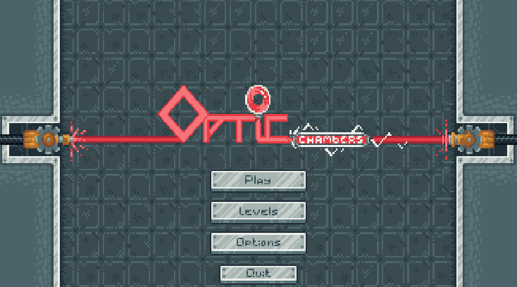

Bienvenue dans **Optic Chambers**, un puzzle game où vous devrez résoudre des énigmes en manipulant des lasers, des miroirs, et d'autres éléments d'optique. Ce projet a été développé dans le cadre de la **Scientific Game Jam 2023**, un événement où les participants créent des jeux autour de thèmes scientifiques avec des doctorants pour vulgariser leurs recherches. 

## Table des matières

- [Optic Chambers - Puzzle Game](#optic-chambers---puzzle-game)
  - [Table des matières](#table-des-matières)
  - [Contexte](#contexte)
  - [Gameplay_fr](#gameplay_fr)
  - [Installation](#installation)
    - [Prérequis](#prérequis)
    - [Instructions](#instructions)
  - [Comment jouer](#comment-jouer)
  - [Contributeurs](#contributeurs)
  - [Notes des développeurs :](#notes-des-développeurs-)
  - [Licence](#licence)

## Contexte

Le projet **Optic Chambers** a été développé lors de la **Scientific Game Jam 2023**, qui s'est tenue du 24 au 26 novembre à Montbéliard. Cette édition unique a intégré des doctorants dans les équipes afin de rendre leurs sujets de recherche accessibles au grand public à travers le jeu vidéo. **Optic Chambers** explore l'**optique**, mettant en lumière des concepts comme la réflexion et la diffraction, tout en proposant une expérience de jeu captivante. Le jeu s'inspire du sujet de thèse du doctorant, portant sur les **chambres de résonance** et l'**intrication quantique** qu'elles peuvent générer.

## Gameplay_fr

Dans **Optic Chambers**, vous devrez guider un faisceau laser en utilisant divers éléments tels que des miroirs, des prismes, des filtres et d'autres composants. L'objectif est d'amener la lumière vers des points spécifiques dans chaque niveau pour activer le récepteur et passer à la chambre suivante.

Voici les éléments avec lesquels vous pouvez interagir :

- **Laser** : Déplacez et faites pivoter des miroirs pour réfléchir le laser.

  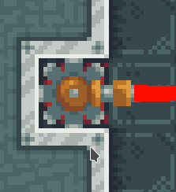
- **Récepteur** : Cible du jeu activée pour gagner, certains boutons ne peuvent être activés que par des lasers de certaines couleurs.

| Cible Activée                  | Cible Désactivée                |
| ------------------------------ | ------------------------------- |
| 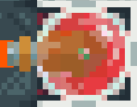 | 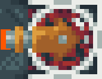 |

- **Miroirs** : Déplacez et faites pivoter des miroirs pour réfléchir le laser. Il existe en deux versions : une fixe et l'autre amovible.

|         Miroir Fixe          |               Miroir Amovible                |
| :--------------------------: | :------------------------------------------: |
| 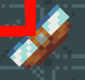 | 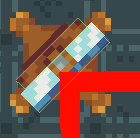 |

- **Split** : Réfractez la lumière pour diviser le faisceau en deux.

  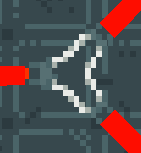
- **Quantic Split** : Utilisez une chambre de résonance pour créer des faisceaux jumelés. Ces faisceaux sont composés d'un jumeau fort et d'un jumeau faible. Toutes les actions effectuées sur le jumeau fort sont répliquées en symétrie sur le jumeau faible.

| Quantic Split Off                                       | Quantic Split On                                      |
| ------------------------------------------------------- | ----------------------------------------------------- |
| 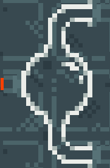 | 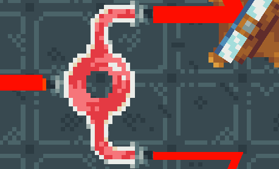 |

- **Portes et boutons** : Activez les boutons pour ouvrir les portes associées, certains boutons ne peuvent être activés que par des lasers de certaines couleurs.

| Porte Ouverte                               | Porte Fermée                                 |
| ------------------------------------------- | -------------------------------------------- |
| 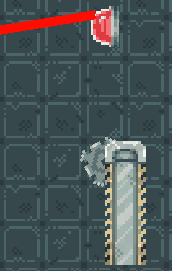 | 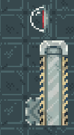 |

- **Filtres** : Modifiez les couleurs des lasers pour correspondre aux objectifs spécifiques.

  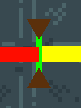

- **Cuve de liquide** : Les cuves sont encore en développement.

Chaque niveau propose des défis de plus en plus complexes, mettant vos compétences de logique et de réflexion à l’épreuve.

## Installation

### Prérequis

Aucun logiciel spécifique n'est requis, à part un ordinateur capable d'exécuter des jeux.

### Instructions

1. Rendez-vous sur la page [Releases](https://github.com/VillerotJustinOrg/ScientificGameJam/releases) du projet.
2. Téléchargez la dernière version du fichier ZIP contenant le jeu.
3. Décompressez l'archive sur votre ordinateur dans un dossier de votre choix.
4. Ouvrez le dossier et exécutez le fichier OpticChambers.exe (ou équivalent selon votre système d'exploitation).

Le jeu est maintenant prêt à être joué !

## Comment jouer

1. **Déplacez** : Utilisez la souris pour sélectionner et faire glisser les objets amovibles.
2. **Faites pivoter** : Utilisez le clic droit sur les éléments qui peuvent tourner. 
3. **Validez** : Une fois que le laser a atteint la cible correctement, le niveau sera validé.

Le but de chaque niveau est d'activer le récepteur en utilisant des lasers pour résoudre les énigmes. Plus vous progressez, plus les défis deviendront complexes !

## Contributeurs

-  **VILLEROT Justin** - Développeur Unity / Game Designer / Team Lead - [Lien](https://github.com/VillerotJustin)
-  **Grégory Grzesiak** - Sound Designer / UX designer - [Lien](https://github.com/Gregory-GRZESIAK?tab=overview&from=2024-09-01&to=2024-09-10)
-  **rayane-damage** - Graphiste Principal - [Lien](https://github.com/rayane-damage)
-  **TODO** - Graphiste Secondaire
-  **TODO** - Level design

Ce projet a été rendu possible grâce à la collaboration de l'Université de Franche-Comté et au soutien du Pavillon des Sciences.

## Notes des développeurs :
**!!! Certaines fonctionnalités sont encore en développement / débogage comme :**
- **Filtres et lasers de différentes couleurs**
- **Cuves de liquide**
- **Zones interdites**
- **Inventaire**
- **Amélioration de l'expérience utilisateur pour le déplacement et le stockage des éléments**

Vous pouvez voir les autres projets de Soul Garden ci-dessous :

## Licence

Ce projet est sous licence [MIT](./LICENCE). Vous êtes libre de modifier, partager et utiliser ce code dans vos propres projets, sous réserve de citer les contributeurs originaux.

---

# ENGLISH

---

# Optic Chambers - Puzzle Game

Welcome to **Optic Chambers**, a puzzle game where you must solve challenges by manipulating lasers, mirrors, and other optical elements. This project was developed as part of the **Scientific Game Jam 2023**, an event where participants create games around scientific themes, with PhD students to popularize their research.

## Table of Contents

- [Optic Chambers - Puzzle Game](#optic-chambers---puzzle-game)
  - [Table of Contents](#table-of-contents)
  - [Context](#context)
  - [Gameplay](#gameplay)
  - [Installation](#installation)
    - [Prerequisites](#prerequisites)
    - [Instructions](#instructions)
  - [How to Play](#how-to-play)
  - [Contributors](#contributors)
  - [Developer Notes:](#developer-notes)
  - [License](#license)
- [ENGLISH](#english)

## Context

The **Optic Chambers** project was developed during the **Scientific Game Jam 2023**, which took place from November 24 to 26 in Montbéliard. This unique edition integrated PhD students into teams to make their research topics accessible to the public through video games. **Optic Chambers** explores the field of **optics**, highlighting concepts like reflection and diffraction while offering a captivating gaming experience. The game draws inspiration from the PhD student's research on **resonance chambers** and the **quantum entanglement** they can create.

## Gameplay

In **Optic Chambers**, you will guide a laser beam using various elements such as mirrors, prisms, filters, and other components. The objective is to direct the light to specific points in each level to activate the receiver and move on to the next chamber.

Here are the elements you can interact with:

- **Laser**: Move and rotate mirrors to reflect the laser.

- **Receiver**: The game’s target, activated to win. Some buttons can only be activated by lasers of specific colors.

| Target Activated               | Target Deactivated              |
| ------------------------------ | ------------------------------- |
|  |  |
- **Mirrors**: Move and rotate mirrors to reflect the laser. There are two types: fixed and movable.

|             Fixed Mirror              |                    Movable Mirror                     |
| :-----------------------------------: | :---------------------------------------------------: |
|  |  |
- **Splitter**: Refract the light to split the beam into two.

- **Quantum Splitter**: Use a resonance chamber to create entangled beams. These beams consist of a strong twin and a weak twin. Any action performed on the strong twin is mirrored symmetrically on the weak twin.

| Quantum Split Off                      | Quantum Split On                      |
| -------------------------------------- | ------------------------------------- |
|  |  |
- **Doors and Buttons**: Activate the buttons to open the associated doors. Some buttons can only be activated by lasers of specific colors.

| Door Open                      | Door Closed                      |
| ------------------------------ | -------------------------------- |
|  |  |
- **Filters**: Modify the colors of the lasers to match specific objectives.

- **Liquid Tanks**: The tanks are still in development.

Each level presents increasingly complex challenges, testing your logic and problem-solving skills.

## Installation

### Prerequisites

No specific software is required, except for a computer capable of running games.

### Instructions

1. Go to the project's [Releases](https://github.com/VillerotJustinOrg/ScientificGameJam/releases) page.
2. Download the latest version of the ZIP file containing the game.
3. Unzip the file on your computer in a folder of your choice.
4. Open the folder and run the `OpticChambers.exe` file (or the equivalent based on your operating system).

The game is now ready to play!

## How to Play

1. **Move**: Use the mouse to select and drag movable objects.
2. **Rotate**: Use the right-click on elements that can rotate.
3. **Confirm**: Once the laser reaches the target correctly, the level will be validated.

The goal of each level is to activate the receiver by using lasers to solve puzzles. As you progress, the challenges become more complex!

## Contributors

-  **VILLEROT Justin** - Unity Developer / Game Designer / Team Lead - [Lien](https://github.com/VillerotJustin)
-  **Grégory Grzesiak** - Sound Designer / UX Designer - [Lien](https://github.com/Gregory-GRZESIAK?tab=overview&from=2024-09-01&to=2024-09-10)
-  **rayane-damage** - Lead Artist - [Lien](https://github.com/rayane-damage)
-  **TODO** - Secondary Artist
-  **TODO** - Level Designer

This project was made possible thanks to the collaboration with the University of Franche-Comté and the support of the Pavillon des Sciences.

## Developer Notes:
**!!! Some features are still in development/debugging such as:**
- **Filters and lasers of different colors**
- **Liquid tanks**
- **Restricted zones**
- **Inventory**
- **Improvement of user experience for moving and storing items**

You can see other projects from Soul Garden below:

## License
This project is licensed under the [MIT License](./LICENSE). You are free to modify, share, and use this code in your own projects, as long as the original contributors are credited.
